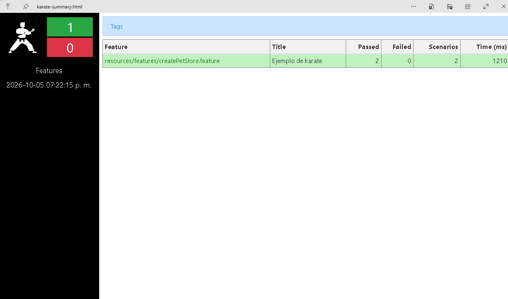

# Automatización de Pruebas de APIs con Karate

Karate (escrito en Java) permite automatizar las pruebas de las APIs, con la ventaja de que no se necesita programar para hacer las pruebas.

## Configuración y Retos del Entorno
Tardé una buena parte del tiempo en instalar y configurar las variables de entorno de Maven, y también en instalar la versión JDK 17 para asegurar una mayor compatibilidad. 

Mis primeras pruebas con la carpeta de Karate se leían con éxito, pero sin lograr ejecutar ninguna prueba debido a problemas con la versión del JDK y la compilación de Maven. Al solucionar este problema cambiando a la versión JDK 17, la compilación y la prueba se ejecutaron correctamente.

## Estructura del Proyecto

* **`karate-config.js`**: Contiene una función de configuración global con el objetivo de definir variables y rutas base que están en todos los archivos de prueba. De esta manera se realizan las pruebas en un entorno de desarrollo / producción. El sistema toma en cuenta que, si no especificas un entorno en los comandos del sistema, se activa una regla por defecto: se obtienen los datos definidos para `dev` en la configuración y arranca tu archivo `.feature`. El código se encarga de cambiar de manera automática las direcciones y configuraciones según el entorno exacto en el que decidas ejecutar la prueba.

* **Archivos `.feature`**: Es un documento en texto plano utilizado en el desarrollo de software orientado a BDD. Usa el lenguaje Gherkin con la estructura de palabras `Feature`, `Given`, `When` y `Then`. Se leen estos archivos utilizando Cucumber para ejecutar pruebas de aceptación de forma automática.

## Resultados de la Primera Prueba

El código mostró la conexión correcta a la API pública de pruebas: [https://petstore.swagger.io/v2/pet](https://petstore.swagger.io/v2/pet).

Se crearon los registros: en el primero se usó un payload JSON registrando una mascota llamada **Vaguito**, y en el segundo se envió otro JSON para registrar a **Firulais**. 

Ambas peticiones recibieron como respuesta del servidor un código HTTP 200 OK, indicando en consola con una tabla (`scenarios: 2 | passed: 2 | failed: 0`) que las pruebas pasaron sin ningún error. Finalmente, el plugin de reportes compiló los resultados visuales.

### Evidencia
